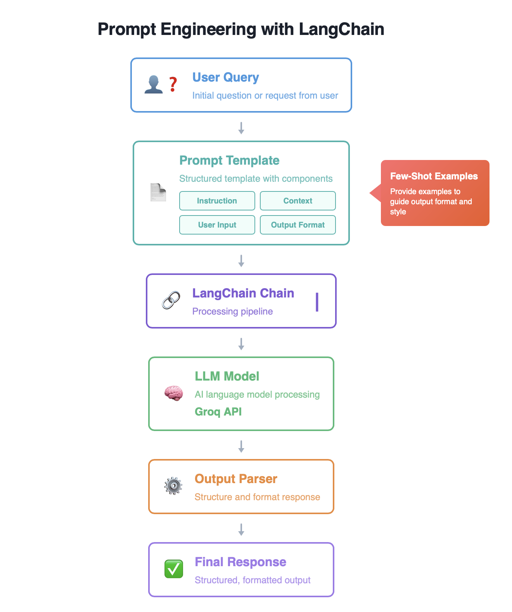
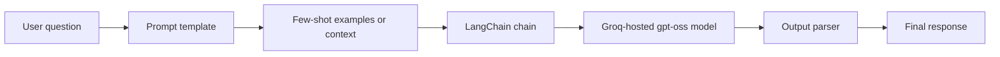

# The Prompt Engineering Workflow

## What is prompt engineering?

Prompt engineering is the practice of designing and refining inputs (prompts) to guide Large Language Models (LLMs) toward producing the outputs you want. Well-crafted prompts can improve the quality, accuracy, and relevance of AI-generated responses without retraining the model.

Why it matters:

- **Control and precision**: direct the model to produce specific formats, tones, or types of responses.
- **Better results with less effort**: get accurate answers without fine-tuning or training custom models.
- **Cost-effective**: optimise the performance of existing pre-trained models.
- **Flexibility**: adapt model behaviour quickly for different use cases.

When to reach for it:

- Building chatbots, virtual assistants, or conversational interfaces.
- Creating content generation systems (documentation, FAQs, summaries).
- Extracting structured information from unstructured text.
- Building Retrieval-Augmented Generation (RAG) systems.
- Prototyping AI applications before investing in custom model training.

## The workflow

Reading the pipeline left to right:

1. **User input / query**: your question or request.
2. **Prompt template**: structures the input with four components (see below).
3. **Few-shot examples**: example input-output pairs that teach the model your desired format.
4. **LangChain chain**: components piped together, `prompt_template | llm | output_parser`.
5. **LLM (Groq API)**: the model processes the prompt with configurable parameters such as `temperature` and `max_tokens`.
6. **Output parser**: formats raw responses into usable structures.
7. **Final response**: polished output for your application.

This workflow controls LLM behaviour without retraining, so you get production-quality results from general-purpose models.

## The four-part prompt structure

A prompt template structures the input with four components:

- **Instruction**: what the model should do.
- **External context**: additional knowledge from documents or databases (source knowledge as opposed to the model's parametric knowledge).
- **User input**: the query, inserted dynamically through variables like `{question}`.
- **Output indicator**: guides the response format (for example `Answer:` or a structured layout).

You will apply this structure directly in the notebooks, starting with simple templates and building up to few-shot prompting and chained output parsers.
